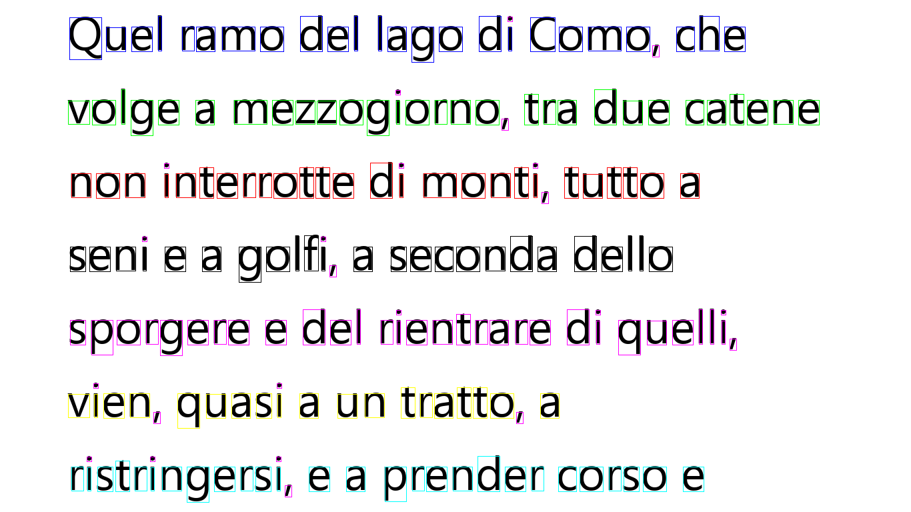

# 2019 Data and Document Mining @ UniFi

    

# Introduction
This repo contains codes and documentations for the "Data and Document Mining" course at University of Florence.

The projects has been conducted together with @francidellungo.

The description report (in _Italian_) can be found in [Report_DDM](https://github.com/emanuelevivoli/2019-Data-and-Document-Mining-UNIFI/tree/main/Report_DDM.pdf).

# Structure

The repo is structured as follow:
- [Cs_to_Py](https://github.com/emanuelevivoli/2019-Data-and-Document-Mining-UNIFI/tree/main/Cs_to_Py) 
- [ClientCs_ServerPy](https://github.com/emanuelevivoli/2019-Data-and-Document-Mining-UNIFI/tree/main/ClientCs_ServerPy)

     
    
    
    Bridge for interconnecting position coordinates streams from eye tracker from `C#` SDK to `python` - _Italian_

- [DDM_eye_tracker](https://github.com/emanuelevivoli/2019-Data-and-Document-Mining-UNIFI/tree/main/DDM_eye_tracker)

    

    Analysis of position coordinates streams from the eye tracker to study where eyes concentrate most on text-ful screen - _Italian_

- [Gaze-plot](https://github.com/emanuelevivoli/2019-Data-and-Document-Mining-UNIFI/tree/main/Gaze-plot)
    
    

    A gaze plot displays movement sequence, order and duration of gaze fixation.

# Examples

Some images that show the text (1), its characters, words ans lines (2), the person saccades and fixations (3), and finally the gaze heatmap plot (4).

    
    
    
    

Some of the files recorded from the user activity.

| id  | sec | word        | row_id  |
|----|----|--------------|----|
| 0  | 16 | monti        | 0  |
| 1  | 22 | golfi        | 4  |
| 2  | 2  | del          | 0  |
| 3  | 0  | Quel         | 2  |
| 4  | 1  | ramo         | 2  |
| 5  | 3  | lago         | 3  |
| 6  | 5  | Como         | 2  |
|    |    |     ...      |    |

# Contacts
If you are interested and have some questions, don't hesitate to contact us or open an issue.

# Licence
Thid-party licences must be respected ([tobi](https://developer.tobii.com/license-agreement/)).
We do not take responsability for the usage of this software.